<div align="center">


<h1>ScotSwim</h1>

<p><strong>A full-stack iOS team-management app for Alma College Swimming & Diving.</strong><br/>
Built entirely in JavaScript — live on the App Store and in daily use by 34 athletes and 2 coaches.</p>

<p>
  
  &nbsp;
  
  &nbsp;
  
  &nbsp;
  
</p>

<br/>

<a href="https://apps.apple.com/us/app/scotswim/id6808666072">
  
</a>

</div>

---

<br/>

## 📱 Live on the App Store

<p align="center">
  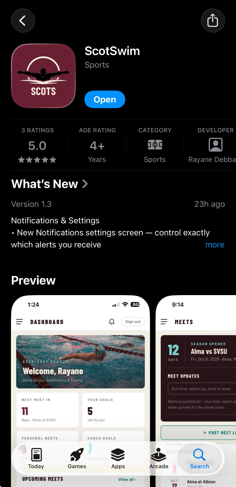
</p>

<p align="center"><em>5.0 ★ · Sports · Age 4+ · Published by Rayane Debbarh</em></p>

---

<br/>

## 🎓 Internship Final Project

ScotSwim was designed and built as the **final project for a Data Engineering internship at [Enopps](https://enopps.com)** — an IT consulting and engineering company based in Morocco, specializing in data solutions, software development, and digital transformation. The internship was hybrid, and the project was developed and shipped end-to-end over its course: from initial concept to a live App Store release used by a real team every day.

---

<br/>

## 🏊 What It Solves

Before ScotSwim, the season ran across paper heat sheets, group texts, spreadsheets, and third-party results sites. Athletes often didn't know what practice was that day. Coaches had no single place to keep any of it.

ScotSwim is that single place.

---

<br/>

## 📸 Screenshots

<p align="center">
  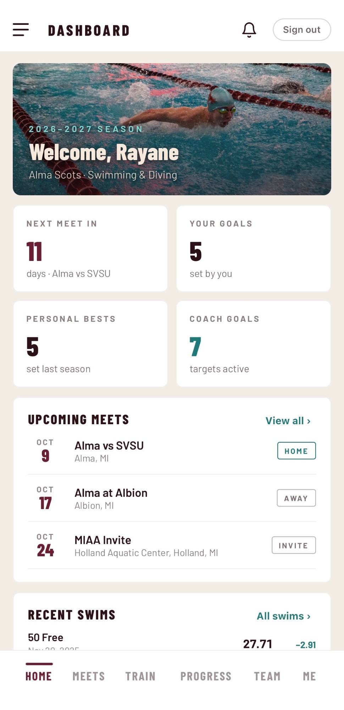
  &nbsp;
  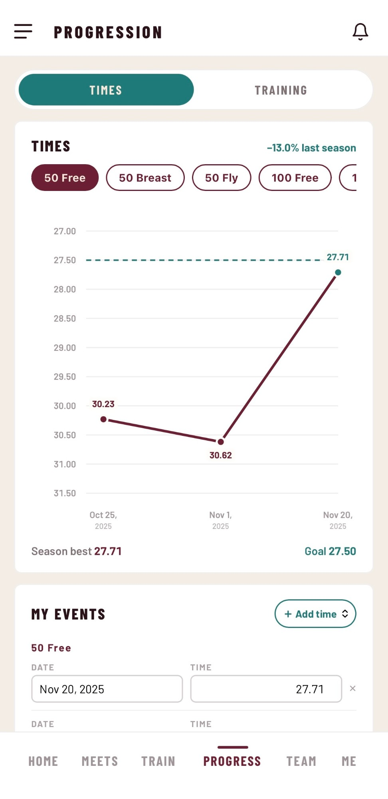
  &nbsp;
  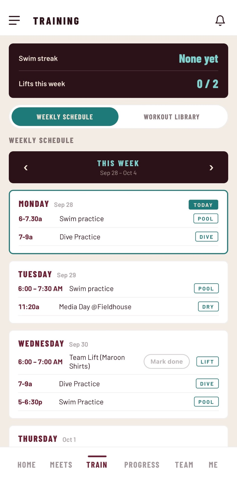
  &nbsp;
  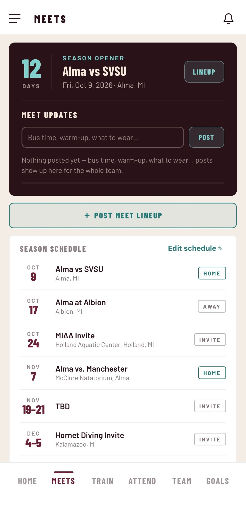
  &nbsp;
  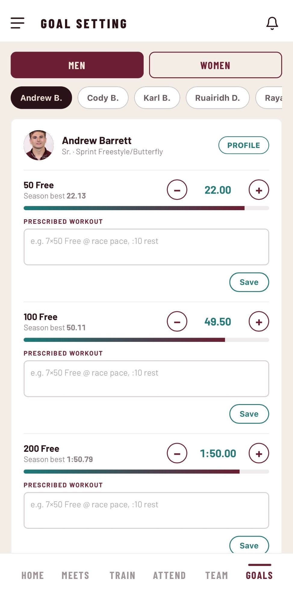
</p>

<p align="center">
  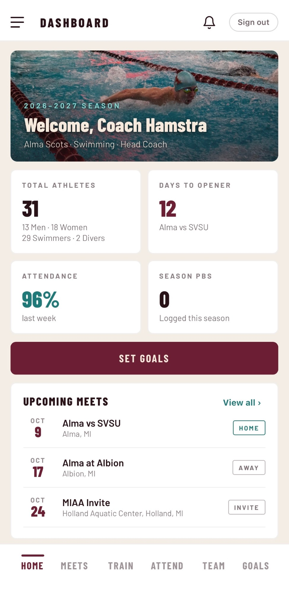
  &nbsp;
  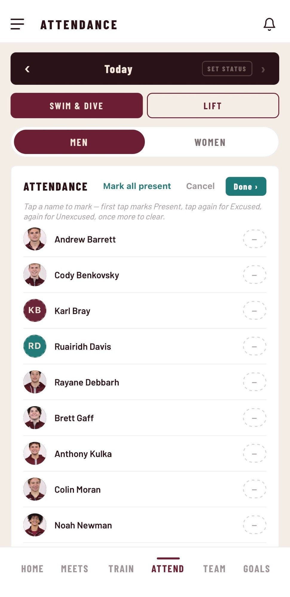
  &nbsp;
  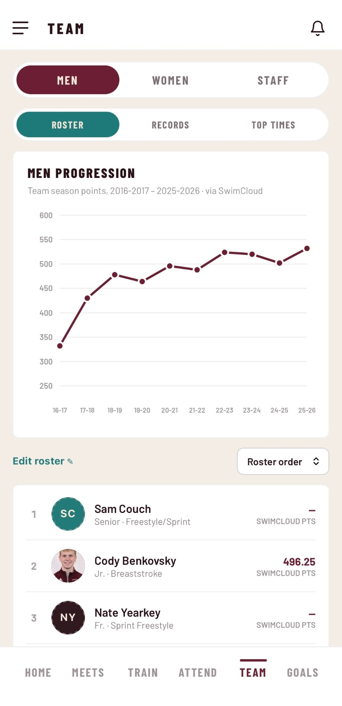
  &nbsp;
  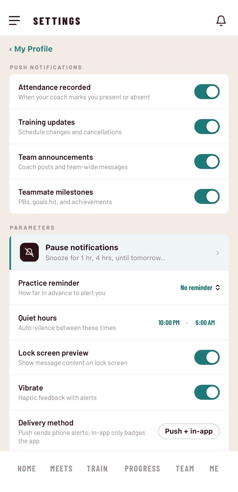
  &nbsp;
  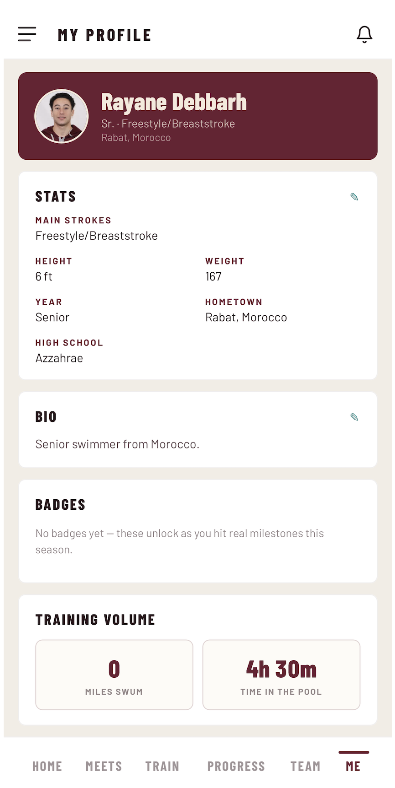
</p>

---

<br/>

## ✨ Features

### For Athletes
| | |
|---|---|
| 🏠 **Dashboard** | Week's practice schedule, next meet countdown, personal best highlights, coach goals summary, and team announcements — all in one view |
| 📈 **Progression** | Log times and dive scores after every meet; the app builds a personal progression chart per event automatically, with improvement deltas against personal bests |
| 🏊 **Meets** | Full season meet calendar with locations and dates; view the official meet lineup posted by coaches, with your specific events highlighted |
| 📋 **Meet Lineup** | Coaches post the heat sheet (as images or PDF) with a note; every athlete sees their own events called out directly in the lineup |
| 🎯 **Goals** | View season goals and prescribed workouts set by the coach; track your own targets alongside them |
| 🏋️ **Training Log** | Log training volume — miles swum and time in the pool — and check off independent lifts from the coach's prescribed lift plan |
| 🤽 **Diving** | Diving-specific goal tracking, dive scores logged per meet, board assignments, and a progression chart built for dive scores rather than swim times |
| 🏆 **Lane & Board Rivalry** | Head-to-head competition block on the dashboard pairing you against a rival teammate — updated live as times and scores are logged |
| 👥 **Team** | Full roster with athlete profiles, stats, bio, and photo |
| 👤 **My Profile** | Personal stats (year, height, weight, hometown, strokes), bio, and profile photo with custom framing |
| 🔔 **Notifications** | Real-time push alerts for announcements, lineup posts, schedule changes, attendance marks, and new goals — with configurable quiet hours and a daily practice reminder |
| ⚙️ **Settings** | Control which notification types you receive, set quiet hours, pause alerts temporarily, and manage your account |

### For Coaches
| | |
|---|---|
| 🏠 **Dashboard** | Season overview with the next meet, recent announcements, and quick access to all coaching tools |
| 🏊 **Meets** | Edit the full season meet calendar; post meet updates (bus time, warm-up instructions, what to wear) visible to the whole team |
| 📋 **Meet Lineup** | Upload the official heat sheet (photos or PDF) for the upcoming meet, add a coach note, and push a notification to the team — athletes see their own events highlighted |
| 📅 **Training Schedule** | Edit the weekly practice schedule (sessions, times, pool lanes) visible to all athletes |
| ✅ **Attendance** | Take practice attendance in seconds with present / excused / unexcused markings; athletes are notified of unexcused absences automatically |
| 📊 **Lift Grid** | Week-at-a-glance grid showing which athletes completed their independent lifts |
| 👥 **Team & Roster** | Manage the full team roster — add and remove athletes, view profiles, stats, and photos |
| 🎯 **Goal Setting** | Set individual season goals for each athlete and write a prescribed workout per goal; athletes see these alongside their own targets |
| 📢 **Announcements & Workout Sheets** | Post team-wide announcements and attach dated workout sheets for athletes to reference |
| 🤽 **Diving** | Full diving-specific section: dive scores, board assignments, diving goals, and progression — managed separately from swim data |
| 🧮 **Meet Simulator** | Project dual-meet scores against MIAA and Division III opponents event by event, using both teams' entry times — so coaches know the score before the bus leaves |
| ⚙️ **Settings** | Notification preferences and account management |

> **Access is invite-only.** Every account comes from a coach-generated invite link bound to a specific email and roster spot. Nothing in the app is visible outside the team.

---

<br/>

## 🛠 Tech Stack

| Layer | Technology |
|---|---|
| **Language** | JavaScript — 100% of the codebase |
| **UI Runtime** | Custom component system with declarative templating, rendering directly to the DOM — no framework |
| **Native Shell** | [Capacitor](https://capacitorjs.com) — wraps the web app in a WKWebView for iOS |
| **Authentication** | Firebase Authentication (email/password) |
| **Database** | Cloud Firestore — 11 collections, real-time listeners |
| **Push Notifications** | Firebase Cloud Messaging |
| **OTA Updates** | [Capgo](https://capgo.app) — ships bug fixes and UI changes without a store review cycle |
| **CI/CD** | GitHub Actions — iOS compile check, Android signed release build, OTA publish |

---

<br/>

## 🏗 Architecture

A single HTML file is the entire application. The UI layer is a custom declarative component runtime: components declare their output as a function of state, and the runtime diffs and patches the DOM. Capacitor wraps it in a native shell without requiring a rewrite — there is one copy of the source in the repo, and a sync script copies it into the native build so the shipped app and the hosted site can never drift apart.

### Firestore Data Model

| Collection | Holds | Written by |
|---|---|---|
| `users` | Account profile: role, roster binding | Account owner |
| `invites` | Outstanding invite tokens | Coaches |
| `roster` | Team roster additions and removals | Coaches |
| `myEvents` | Logged meet times and dive scores | Athletes |
| `trainingLog` | Training volume and lift check-ins | Athletes |
| `goalWorkouts` | Coach-prescribed workouts | Coaches |
| `training` | Weekly practice schedule | Coaches |
| `schedule` | Season meet calendar | Coaches |
| `attendance` | Per-day attendance marks | Coaches |
| `announcements` | Team announcements | Coaches |
| `workoutSheets` | Dated workout sheet attachments | Coaches |

Per-athlete documents are keyed by roster identity, so ownership is a property of the document path — not something the client asserts.

### Security Model

Access control lives in Firestore security rules, not in client code. Two predicates do most of the work: `isCoach()` reads the caller's own profile to verify their role, and `isSelf(rosterId)` verifies the caller is bound to the document they're writing.

### Derived Metrics

Nothing is stored that can be computed. Attendance rates, practice streaks (swim sessions only — a lift-only day neither extends nor breaks one), per-event improvement deltas against personal bests, weekly lift roll-ups, and the meet simulator's projected score are all derived at read time.

---

<br/>

## 🧩 Engineering Challenges

**Safe-area insets returned zero.**
`env(safe-area-inset-*)` reports 0 inside the Capacitor WKWebView, so the header sat under the status bar and the nav sat over the home indicator. Fixed by probing for a live value on mount and falling back to insets derived from screen dimensions, with a high-water mark so rotation never collapses the padding.

**Sign-in took seconds — and it wasn't the network.**
Loading the dashboard fired a separate state update per athlete profile, re-rendering the whole component tree ~30 times before it settled. Batching those reads into a single flush cut it to 9 DOM mutations.

**Account deletion silently did nothing.**
The profile document was deleted before the auth account, and a Firestore security rule blocked that delete — so the promise chain aborted and the account survived. Profile cleanup is now best-effort; the credential deletion runs regardless.

**"No account found" on a valid address.**
A race between Firebase Auth issuing a token and Firestore accepting it surfaced as `permission-denied`, which the app reported as a missing account. Transient codes are now classified and retried with exponential backoff — a wrong password still fails immediately rather than being masked by retries.

**Notification vibration fired on every login.**
The notifications listener compared incoming data against the previous state — which on first load was always zero, so any existing notification triggered the haptic. Fixed with a connection-established flag that skips the first snapshot.

---

<br/>

## 📁 Repository Layout

```
ScotSwim.dc.html          the entire app — UI, state machine, Firestore wiring
privacy.html              privacy policy (served via GitHub Pages)
photos/                   athlete profile photos
mobile-app/
  ios/                    Xcode project (Capacitor shell)
  android/                Android project (Capacitor shell)
  scripts/sync-web.sh     copies repo root into www/ before every cap sync
store-listing/
  screenshots/ios/        App Store screenshots (iPhone 6.9")
  app-store-listing.webp  App Store page screenshot
  listing.md              store description copy and keyword list
.github/workflows/        CI: Android signed build, iOS compile check, OTA publish
```

---

<br/>

## 🚀 Running Locally

Serve the repo root over HTTP and open `ScotSwim.dc.html` — there is no build step.

For the native builds:

```bash
cd mobile-app
npm install
npm run sync        # copies web assets from the repo root, then runs cap sync
npx cap open ios    # opens Xcode
```

> Firebase credentials are the project's public web config. Access is enforced by Firestore security rules, not by keeping the config secret.

---

<div align="center">
  <br/>
  <p>Built by <strong>Rayane Debbarh</strong> · Final project for a Data Engineering internship at <a href="https://enopps.com">Enopps</a>, Morocco</p>
  <p>
    <a href="https://rayanedebbarh.github.io/ScotSwim-app/privacy.html">Privacy Policy</a>
  </p>
</div>

